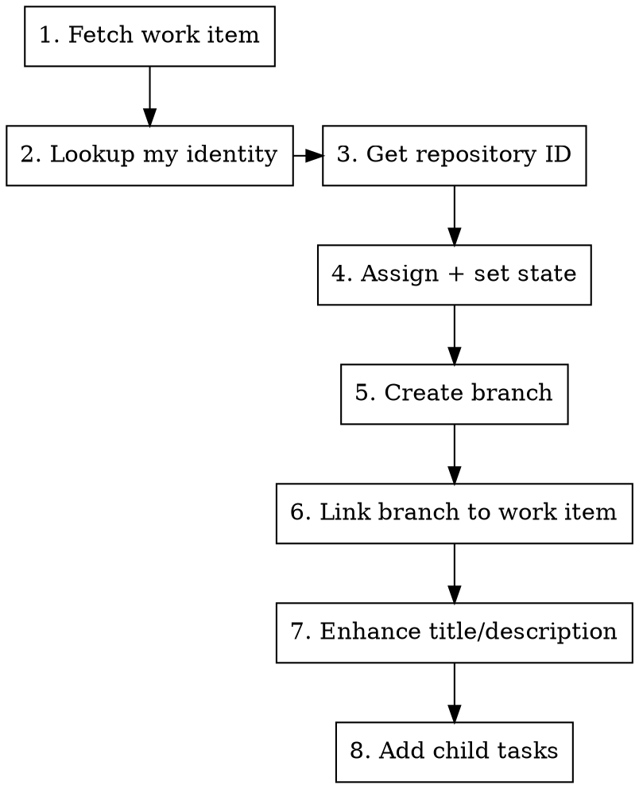

# Picking Up Azure DevOps Work Item

## Overview

Complete workflow for claiming a work item from the Azure DevOps board using MCP tools. Covers fetching, assigning, state transition, branch creation with correct naming, and enhancing the work item with missing details.

## When to Use

- "Pick up work item X", "start working on item X", "grab item X"
- Starting work on a story or bug from the board
- Need to create a feature branch from a work item number
- Need to flesh out a work item before implementation

## Workflow



Steps 2 and 3 can run in parallel (no dependency between them).

### Step 1: Fetch the Work Item

```
mcp__azure-devops__wit_get_work_item
  id: 12345          # number, NOT string
  project: "MyProject"
  expand: "all"      # get relations, fields, links
```

From the response, extract:
- `System.WorkItemType` → determines branch prefix (`User Story` → `story`, `Bug` → `bug`)
- `System.Title` → used for branch slug and enhancement analysis
- `System.Description` → check if empty/sparse for enhancement
- `System.State` → current state before transition

### Step 2: Lookup Identity (parallel with Step 3)

```
mcp__azure-devops__core_get_identity_ids
  searchFilter: "Artiom Tofan"    # display name, email, or unique name
```

Returns identity ID needed for assignment. **Parameter is `searchFilter` (string), not `identities` (array).**

### Step 3: Get Repository ID (parallel with Step 2)

```
mcp__azure-devops__repo_get_repo_by_name_or_id
  project: "MyProject"
  repositoryNameOrId: "my-repo"   # NOT "repositoryId"
```

Returns `id` (GUID) needed for branch creation and artifact linking. Also returns `project.id` (GUID) needed for linking.

### Step 4: Assign and Set State

```
mcp__azure-devops__wit_update_work_item
  id: 12345          # number
  updates: [
    { "path": "/fields/System.AssignedTo", "value": "<identity_display_name_or_email>" },
    { "path": "/fields/System.State", "value": "Active" }
  ]
```

**State values by process template:**
- Agile: `New` → `Active` → `Resolved` → `Closed`
- Scrum: `New` → `Committed` → `Done`
- Basic: `To Do` → `Doing` → `Done`

Use `Active` (Agile) or `Committed` (Scrum) for "in progress". If unsure, check the work item type states with `wit_get_work_item_type`.

### Step 5: Create Branch

```
mcp__azure-devops__repo_create_branch
  repositoryId: "<repo_guid_from_step_3>"    # GUID, not name
  branchName: "story/12345/implement-user-auth"
  sourceBranchName: "main"                    # or "master", from repo default branch
```

#### Branch Naming Convention

**Format:** `{type}/{work_item_id}/{short-title}`

| Work Item Type | Branch Prefix |
|---------------|---------------|
| User Story    | `story/`      |
| Bug           | `bug/`        |

**Title slugification rules:**
1. Take the work item title
2. Lowercase
3. Keep only alphanumeric and spaces
4. Replace spaces with hyphens
5. Truncate to 3-5 meaningful words (max ~40 chars)
6. Trim trailing hyphens

**Examples:**
- User Story "Implement User Authentication System" → `story/12345/implement-user-auth-system`
- Bug "Login Page Crashes on Empty Email Input" → `bug/67890/login-page-crashes-empty-email`
- Bug "NullReferenceException When Saving User Profile Settings" → `bug/11111/null-ref-saving-user-profile`

### Step 6: Link Branch to Work Item

```
mcp__azure-devops__wit_add_artifact_link
  workItemId: 12345
  project: "MyProject"
  linkType: "Branch"
  repositoryId: "<repo_guid>"
  projectId: "<project_guid>"
  branchName: "story/12345/implement-user-auth"    # without refs/heads/
```

### Step 7: Enhance the Work Item

Analyze the existing work item and update with missing information:

```
mcp__azure-devops__wit_update_work_item
  id: 12345
  updates: [
    { "path": "/fields/System.Title", "value": "<enhanced_title>" },
    { "path": "/fields/System.Description", "value": "<enhanced_html>" },
    { "path": "/fields/Microsoft.VSTS.Common.AcceptanceCriteria", "value": "<criteria_html>" }
  ]
```

**Enhancement checklist - analyze and add what's missing:**

| Field | What to Check | What to Add |
|-------|--------------|-------------|
| **Title** | Vague? Too long? Missing verb? | Clear action verb + subject + context |
| **Description** | Empty? One-liner? No context? | Problem statement, user impact, technical context, scope |
| **Acceptance Criteria** | Missing? Vague? | Testable criteria in Given/When/Then or checklist format |
| **Repro Steps** (bugs) | Missing? Incomplete? | Step-by-step reproduction with expected vs actual. Field: `/fields/Microsoft.VSTS.TCM.ReproSteps` |

**Title enhancement rules:**
- Start with action verb: "Implement", "Fix", "Add", "Update"
- Include the subject/component: "user authentication", "login page"
- Add context if ambiguous: "for mobile app", "in checkout flow"
- Keep under 80 characters

**Description format (HTML):**
```html
<h3>Problem</h3>
<p>What problem does this solve? Who is affected?</p>
<h3>Requirements</h3>
<ul>
  <li>Requirement 1</li>
  <li>Requirement 2</li>
</ul>
<h3>Technical Notes</h3>
<p>Any implementation hints, constraints, or dependencies.</p>
```

### Step 8: Add Child Tasks

```
mcp__azure-devops__wit_add_child_work_items
  parentId: 12345                    # number
  project: "MyProject"
  workItemType: "Task"
  items: [
    { "title": "Task title", "description": "What to do" },
    { "title": "Another task", "description": "Details" }
  ]
```

**Use `wit_add_child_work_items`** - it creates AND links in one call. Do NOT use `wit_create_work_item` + separate linking.

**Typical task breakdown:**
- Implementation task(s) for core logic
- Unit/integration test task
- UI task (if applicable)
- Documentation/config update task (if applicable)

## Common Mistakes

| Mistake | Fix |
|---------|-----|
| Passing `id` as string `"12345"` | Must be number `12345` |
| Using `repositoryId` param in `repo_get_repo_by_name_or_id` | Use `repositoryNameOrId` |
| Using `identities: [...]` for identity lookup | Use `searchFilter: "name"` |
| Branch name `feature/12345-title` | Use `story/12345/title` or `bug/12345/title` |
| Creating tasks with `wit_create_work_item` then linking | Use `wit_add_child_work_items` (does both) |
| Using repo name in `repo_create_branch` | Must use repo GUID from `repo_get_repo_by_name_or_id` |
| Skipping artifact link after branch creation | Always link branch to work item |
| Setting state without checking process template | Check with `wit_get_work_item_type` if unsure |
