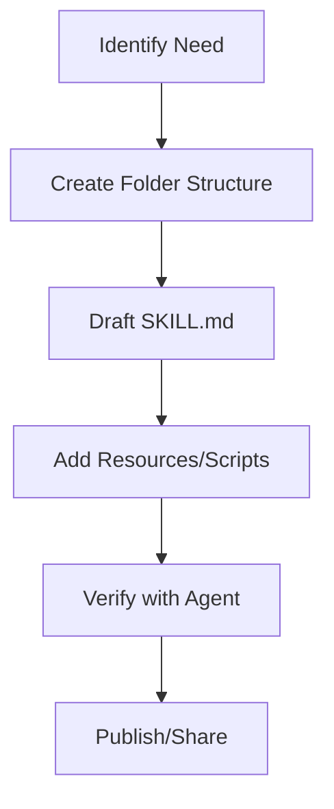

# Skill Creator

The `skill-creator` is designed to help you build high-quality, actionable skills that extend agent capabilities. This guide provides both the instructions for using this skill and the reference standards for the skills you create.

## When to Use This Skill

- **Creating New Skills**: When you need to package specific workflows or knowledge into a reusable agent skill.
- **Refining Documentation**: When an existing `SKILL.md` needs better formatting, clearer instructions, or more practical examples.
- **Enforcing Standards**: When you want to ensure a skill follows the official Antigravity skill structure and conventions.

## How to Use This Skill

When this skill is active, you should follow these steps to assist the user:

1.  **Define Purpose**: Ask clarifying questions to understand the specific task the skill should address.
2.  **Draft SKILL.md**: Use the template below to create a structured instruction file.
3.  **Define Folder Structure**: Identify if additional `scripts/`, `examples/`, or `resources/` are needed.
4.  **Verify Quality**: Review the drafted skill against the [Best Practices](#best-practices) section.

## Skill Folder Structure

A complete skill should follow this directory layout:

```text
.agent/skills/your-skill-name/
├── SKILL.md            # Main instructions (REQUIRED)
├── scripts/            # Helper scripts and utilities
├── examples/           # Reference code and implementations
└── resources/          # Templates, diagrams, or static assets
```

### Visualizing the Skill Lifecycle



## SKILL.md Template

Every skill **MUST** start with YAML frontmatter and follow a consistent header hierarchy.

```markdown
---
name: skill-name
description: A clear description of what the skill does and when to use it.
---

# Skill Name

## When to Use This Skill

- [Condition 1]
- [Condition 2]

## How to Use It

1. [Step 1]
2. [Step 2]

## Best Practices

- [Tip 1]
- [Tip 2]
```

## Best Practices

> [!IMPORTANT]
> **Keep Skills Focused**: Each skill should do one thing well. Avoid creating "mega-skills" that are hard for the agent to parse.

> [!TIP]
> **Write Actionable Descriptions**: The description is the "hook" the agent uses to discover your skill. Use specific keywords like "Generates unit tests" or "Deploys to AWS".

> [!NOTE]
> **Progressive Disclosure**: Agents only read the full `SKILL.md` when they identify it as relevant. Keep the description concise but informative.

## Example: Code Review Skill

```markdown
---
name: code-review
description: Reviews code changes for bugs, style issues, and best practices.
---

# Code Review

When reviewing code, focus on:

1. **Correctness**: Logic and edge cases.
2. **Style**: Alignment with project conventions.
3. **Performance**: Potential bottlenecks.
```
